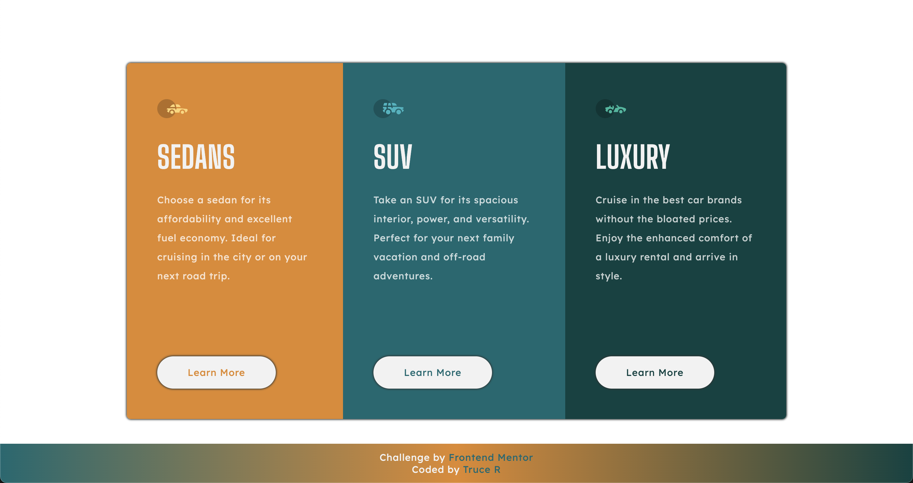

# Frontend Mentor - 3 column preview card component solution

This is a solution to the [3-column preview card component challenge on Frontend Mentor](https://www.frontendmentor.io/challenges/3column-preview-card-component-pH92eAR2-). Frontend Mentor challenges help you improve your coding skills by building realistic projects.

## Table of contents

- [Overview](#overview)
  - [The challenge](#the-challenge)
  - [Screenshot](#screenshot)
  - [Links](#links)
- [My process](#my-process)
  - [Built with](#built-with)
  - [Continued development](#continued-development)
- [Author](#author)

## Overview

### The challenge

Users should be able to:

- View the optimal layout depending on their device's screen size
- See hover states for interactive elements

### Screenshot



### Links

- Solution URL: [FEM Solution](https://www.frontendmentor.io/solutions/3-column-component-preview-card-challenge-NkLj_LR261)
- Live Site URL: [Live Site](https://devtruce.github.io/3-column-card/)

## My process

I had a fun time with this challenge and it was great to help get some real practice while learning, I enjoyed using flexbox to layout the elements and for the most part I think I did the challenge relatively well for where I am at in my learning journey. I am disappointed that I was unable to get the colors correct on the image but I will come back to that and get it working correctly.

### Built with

- HTML5
- CSS3
- Flexbox

### Built with

```html
<section class="sedan">
  <div class="vehicle-icon"><a href="#NOWHERE"></a></div>
  <h2 class="vehicle-heading">SEDANS</h2>
  <p class="vehicle-text">
    Choose a sedan for its affordability and excellent fuel economy. Ideal for
    cruising in the city or on your next road trip.
  </p>
  <a class="learn-more" href="#Learn-More">Learn More</a>
</section>
```

```css
body {
  min-height: 100vh;
  display: flex;
  align-items: center;
  justify-content: center;
  flex-direction: column;
  background-color: var(--semi-transp);
  box-sizing: border-box;
  font-family: "Lexend Deca";
  font-weight: 400;
  font-size: 0.938rem;
  color: var(--very-lightgrey);
}

.container {
  display: flex;
  flex-direction: column;
  justify-content: space-evenly;
  max-width: 100%;
  /* border: 3px solid red; */
  box-shadow: 0 0 3px 1px #2c3333;
  margin: 5rem 1.5rem;
  border-radius: 0.4rem;
  overflow: hidden;
}

.vehicle-icon {
  background-image: url(images/icon-sedans.svg);
  background-repeat: no-repeat;
  background-position: center;
  background-size: 100%;
  height: 3rem;
  width: 3rem;
  cursor: pointer;
}

.vehicle-icon:hover,
.vehicle-icon:focus {
  transform: scale(1.2);
  transition: transform 250ms ease-in-out;
}
```

### Continued development

My main focus is still using flexbox better as well as relative units over absolute units.

## Author

- Frontend Mentor - [@DevTruce](https://www.frontendmentor.io/profile/DevTruce)
