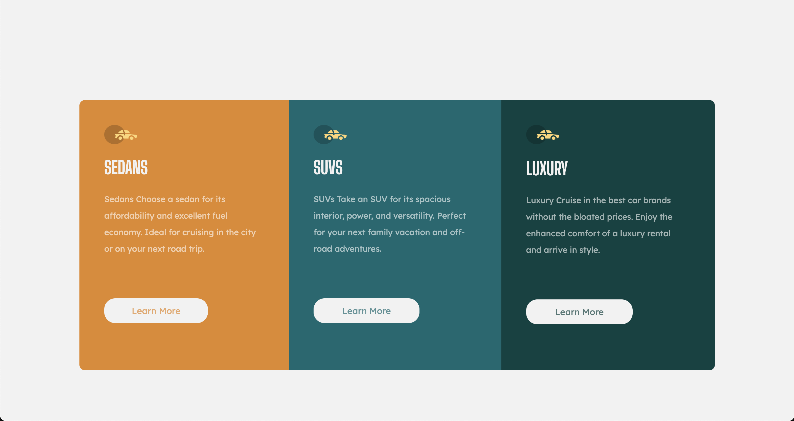

# Frontend Mentor - 3-column preview card component solution

## Table of contents

- [Overview](#overview)
  - [The challenge](#the-challenge)
  - [Screenshot](#screenshot)
  - [Links](#links)
- [My process](#my-process)
  - [Built with](#built-with)
  - [What I learned](#what-i-learned)
  - [Continued development](#continued-development)
- [Author](#author)

## Overview

This is a solution to the [3-column preview card component challenge on Frontend Mentor](https://www.frontendmentor.io/challenges/3column-preview-card-component-pH92eAR2-). Frontend Mentor challenges help you improve your coding skills by building realistic projects.

### The challenge

Users should be able to:

- View the optimal layout depending on their device's screen size
- See hover states for interactive elements

### Screenshot



### Links

- Solution URL: [FEM Solution](https://www.frontendmentor.io/solutions/3-column-component-preview-card-challenge-NkLj_LR261)
- Live Site URL: [Live Site](https://devtruce.github.io/3-column-card/)

## My process

### Built with

- HTML5
- CSS3
- Flexbox

### What I learned

Use this section to recap over some of your major learnings while working through this project. Writing these out and providing code samples of areas you want to highlight is a great way to reinforce your own knowledge.

To see how you can add code snippets, see below:

```html
<section class="left">
  
  <h1>SEDANS</h1>
  <p class="vehicle-text">
    Sedans Choose a sedan for its affordability and excellent fuel economy.
    Ideal for cruising in the city or on your next road trip.
  </p>
  <button>Learn More</button>
</section>

<section class="middle">
  
  <h1>SUVS</h1>
  <p class="vehicle-text">
    SUVs Take an SUV for its spacious interior, power, and versatility. Perfect
    for your next family vacation and off-road adventures.
  </p>
  <button>Learn More</button>
</section>

<section class="right">
  <a href="#"
    ></a>
  <h1>LUXURY</h1>
  <p class="vehicle-text">
    Luxury Cruise in the best car brands without the bloated prices. Enjoy the
    enhanced comfort of a luxury rental and arrive in style.
  </p>
  <button>Learn More</button>
</section>
```

```css
body {
  display: flex;
  justify-content: center;
  align-items: center;
  height: 100vh;
  background-color: hsl(0, 0%, 95%);
}

h1 {
  font-family: "Big Shoulders Display";
  font-weight: 700;
  color: hsl(0, 0%, 95%);
  text-transform: uppercase;
  font-size: 32px;
  margin: 1.75rem 0;
}

button {
  background-color: hsl(0, 0%, 95%);
  border-radius: 20px;
  font-family: "Lexend Deca";
  font-weight: 400;
  padding: 0.5rem 1rem 0.5rem 1rem;
  margin: 5rem 0 0 0;
  width: 65%;
  font-size: 16px;
  height: 3rem;
  border: transparent;
}

.left button:hover,
.middle button:hover,
.right button:hover {
  background-color: transparent;
  color: white;
  border: 1px solid white;
}

.left button,
.left img {
  color: rgba(227, 136, 38, 0.7);
}

.middle button,
.middle img {
  color: rgba(0, 105, 112, 0.7);
}

.right button,
.right img {
  color: rgba(0, 66, 65, 0.7);
}

.container {
  display: flex;
  flex-direction: row;
  max-width: 100%;
  max-height: 100%;
  width: 80%;
  height: 400px;
  border-radius: 10px;
}
```

### Continued development

My main focus is still using flexbox better as well as relative units over absolute units.

## Author

- Frontend Mentor - [@DevTruce](https://www.frontendmentor.io/profile/DevTruce)
